# 🚖 My Riding App

A **real-time ride-booking platform** built with **React.js** for the frontend and **Node.js** for the backend. The app allows passengers to find nearby captains (drivers), select a vehicle, start a ride using OTP, and complete it securely.

---

## 📽️ Project Demo

[](https://drive.google.com/file/d/1fFoS8gFnAle6Jceq5UFlwfGFFUx60pYs/view?usp=sharing)

---

## 📱 Screens Overview

---

### 🧑‍💼 Authentication

#### 1. User Login

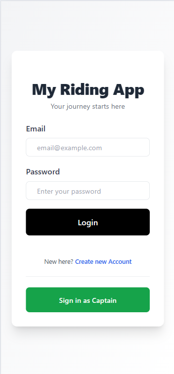  
_Login screen for passengers with email and password fields._

#### 2. Create Account

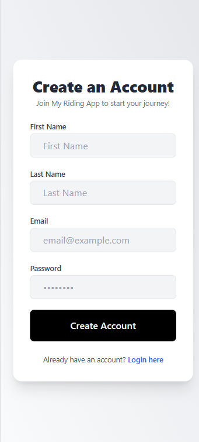  
_User registration form to sign up with full name, email, and password._

#### 3. Captain Login

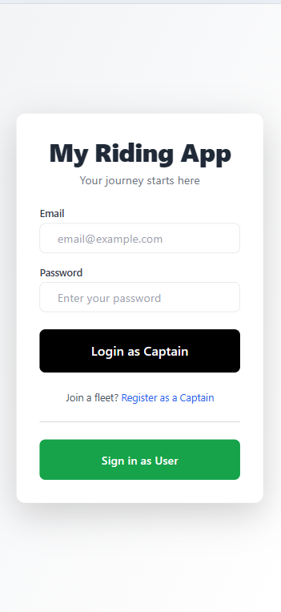  
_Login screen for captains (drivers)._

#### 4. Captain Signup

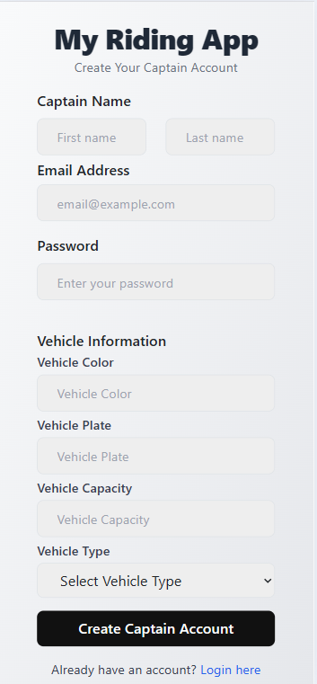  
_Signup form for captains with vehicle information._

---

### 👤 Passenger Flow

#### 5. Home Screen

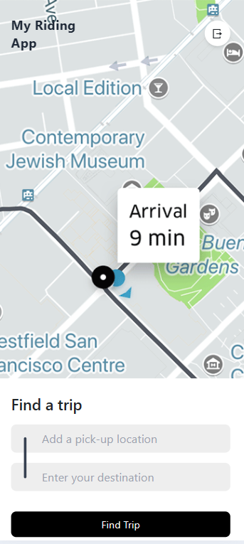  
_Main screen with welcome message and trip booking option._

#### 6. Trip Booking

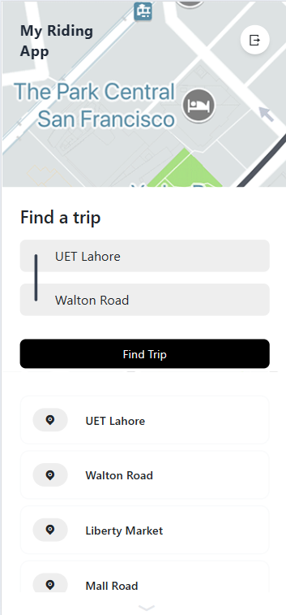  
_Input fields to select pickup and destination using suggestions._

#### 7. Vehicle Selection

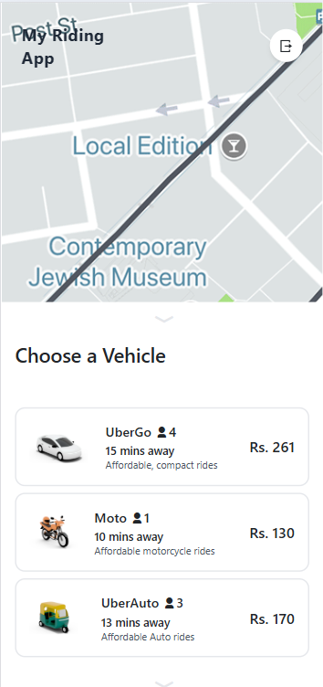  
_Choose from Moto, Auto, or Bike with ETA and fare._

#### 8. Ride Confirmation

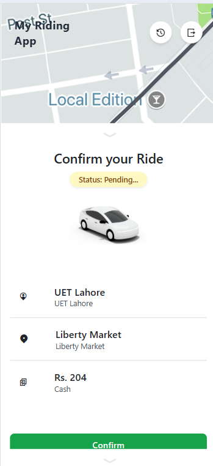  
_Confirm ride details before requesting captain._

#### 9. Looking for Rider

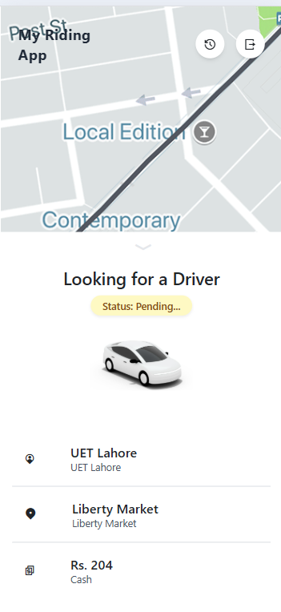  
_Screen displayed to the user after requesting a ride, showing that the system is searching for an available captain._

#### 10. OTP Screen

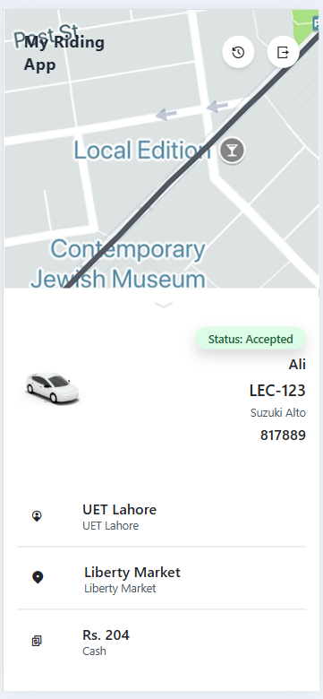  
_Map view showing pickup to destination route._

#### 11. Ongoing Ride

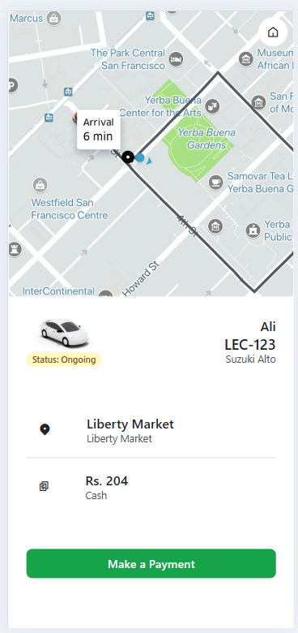  
_Screen displayed to the user while the ride is in progress. It shows ride status as **Ongoing** and includes a payment button that becomes active once the ride is completed._

#### 12. User Ride History

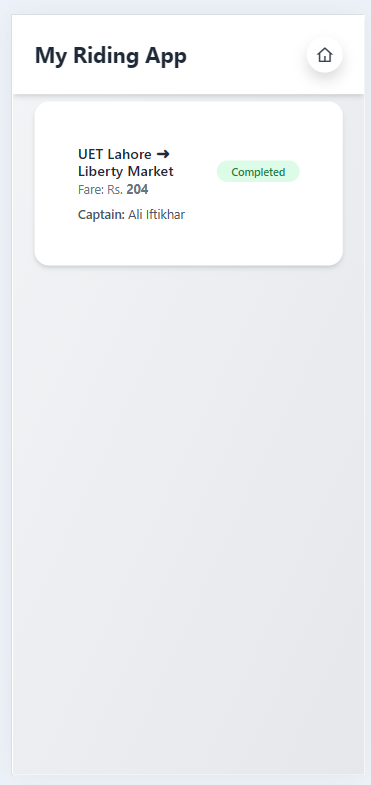  
_Screen where the user can view a history of all their booked rides, including captain name, pickup and drop-off locations, fare amounts, and ride dates._

---

### 🚗 Captain Flow

#### 13. Captain Dashboard

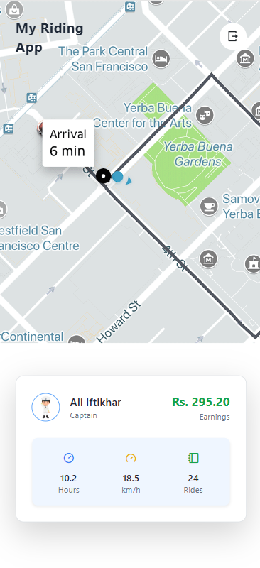  
_Main screen for captains with ride stats and actions._

#### 14. Ride Request

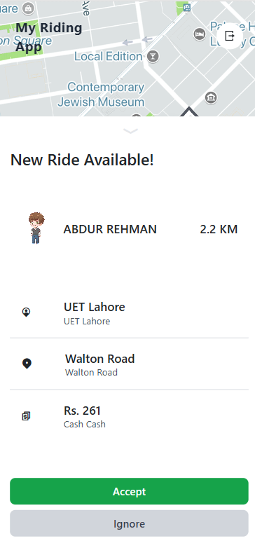  
_Incoming request shown to captains with location and fare info._

#### 15. OTP Entry

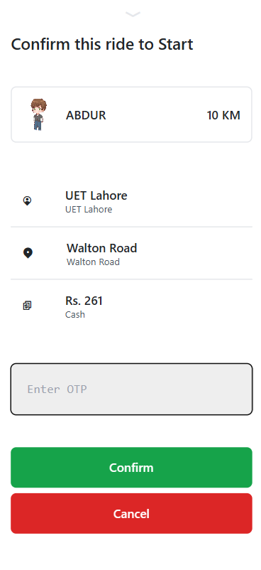  
_Captain enters passenger OTP to start the ride._

#### 16. Ride Completion

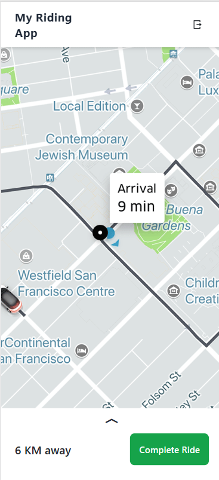  
_Screen displayed to the captain for completing the ride._

#### 17. Finish Ride

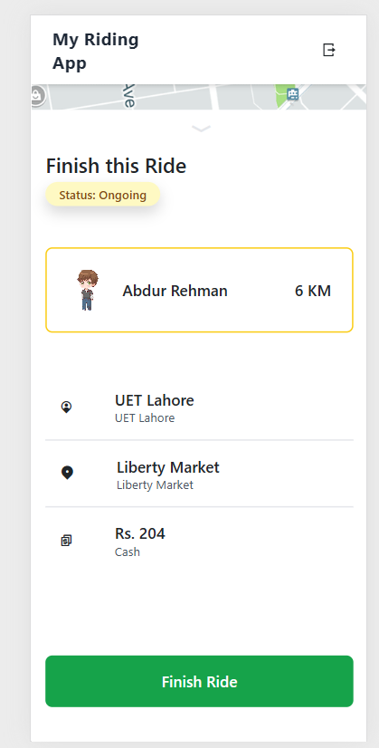  
_Screen displayed to the captain showing user name, pickup location, destination, fare amount, and a **Finish Ride** button._

#### 18. Captain Ride History

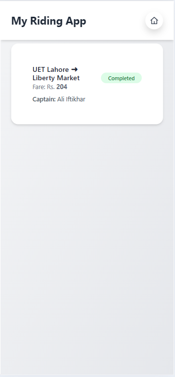  
_Screen where the captain can view a list of all previously completed rides, including user names, pickup and drop-off locations, fare amounts, and ride dates._

---

## 🗂️ ERD (Entity Relationship Diagram)

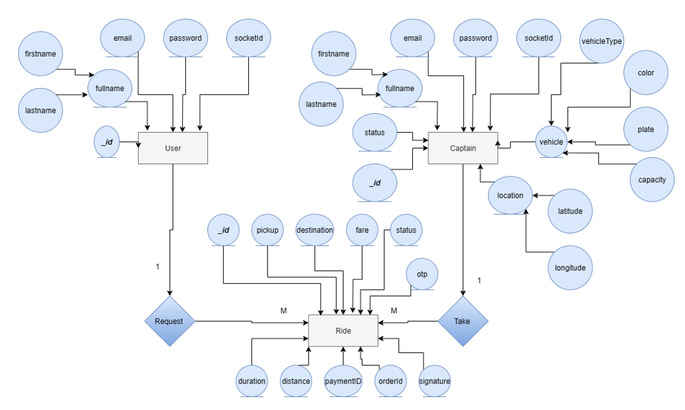  
_This diagram shows the relationship between Users, Captains, and Rides._

---

## ⚙️ Tech Stack

| Layer        | Technologies                              |
| ------------ | ----------------------------------------- |
| **Frontend** | React.js, Tailwind CSS, Axios             |
| **Backend**  | Node.js, Express, MongoDB (Mongoose), JWT |
| **Realtime** | Socket.IO for captain-user messaging      |
| **Security** | OTP verification, token-based login       |

---

## 🔁 User Flow

### Passenger

1. Login / Signup
2. Choose pickup and destination
3. Select vehicle
4. Confirm ride and get OTP
5. Share OTP with captain
6. Complete ride and pay

### Captain

1. Login / Signup with vehicle
2. Accept ride requests
3. Enter OTP to start ride
4. Navigate and complete ride

---

## 🧪 Setup Instructions

### Backend

```bash
cd Backend
npm install
npm start
```

### Frontend

```bash
cd Frontend
npm install
npm run dev
```

### Environment Variables

#### Backend `.env`

```
JWT_SECRET=your_secret
MONGO_URI=your_mongo_connection
```

#### Frontend `.env`

```
VITE_BASE_URL=http://localhost:3000
```

---

## 🧯 Troubleshooting

| Problem                  | Solution                                   |
| ------------------------ | ------------------------------------------ |
| 500 error on booking     | Check pickup/destination spelling          |
| No captain receives ride | Add location to new captain mock data      |
| OTP not working          | Check socket or Twilio config              |
| White screen             | Ensure frontend is running on correct port |

---

## 👤 Author

**Abdur Rehman**
📫 Email: `rehmanabdur643@gmail.com`
🔗 [GitHub Profile](https://github.com/Abdur-Rehman-643)
🔗 [LinkedIn](https://www.linkedin.com/in/abdur-rehman-0a3186278/)

---

## 🚀 GitHub Repository

🔗 **[My Riding App on GitHub](https://github.com/Abdur-Rehman-643/my-riding-app.git)**

> A production-ready, socket-enabled ride-hailing app with complete passenger and captain workflow built for modern real-world applications.

---
